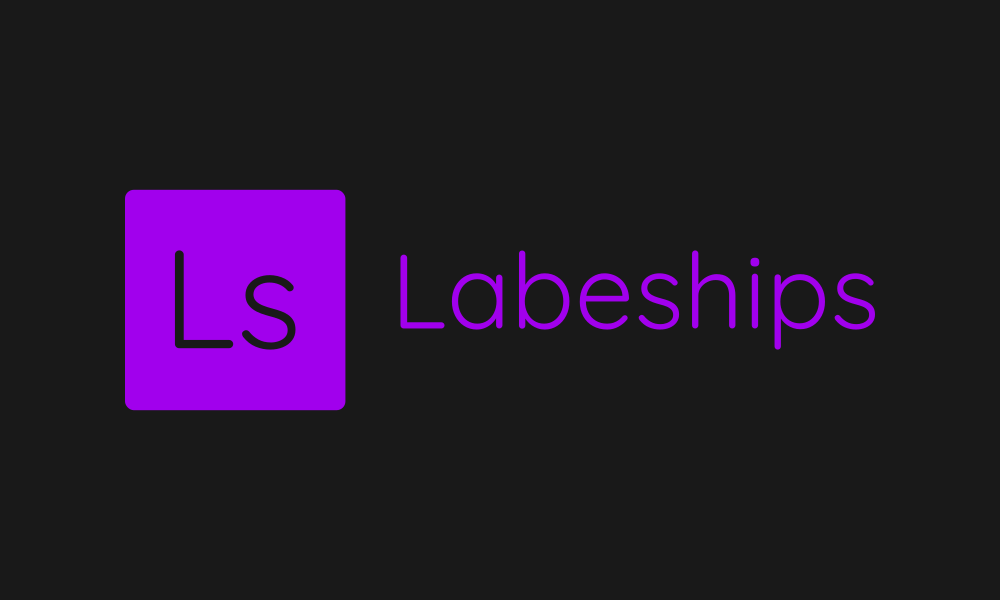
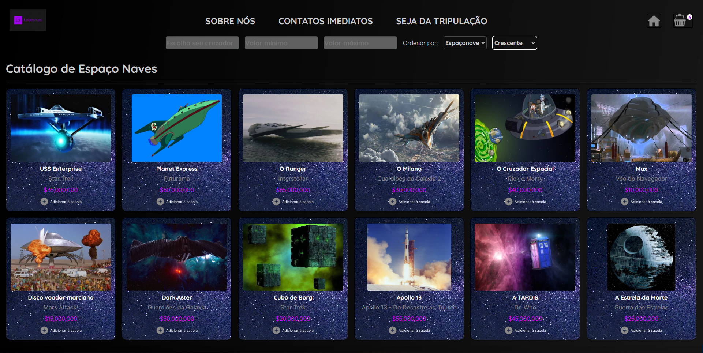
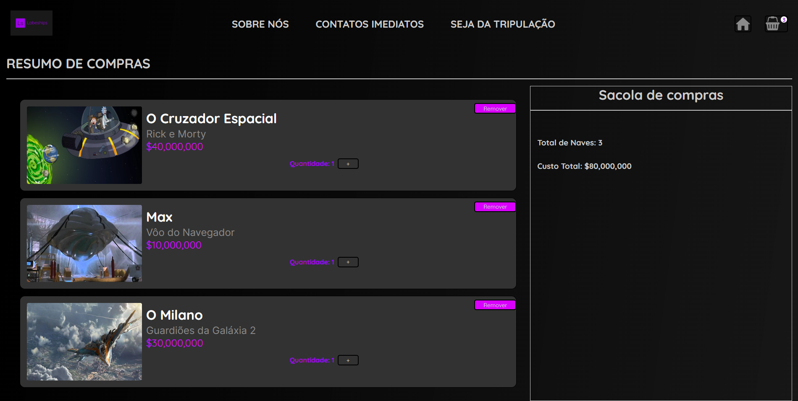

# Projeto Front-end React


Um loja das espaçonaves mais famosas da filmografia mundial feito como projeto de introdução aos fundamentos do React na Labenu. 🚀

## Índice
- <a href="#funcionalidades">Funcionalidades do Projeto </a>
- <a href="#layout">Layout </a>
- <a href="#rodar">Como rodar esse projeto </a>
- <a href="#tecnologias">Tecnologias utilizadas </a>
- <a href="#autores">Pessoas autoras </a>
- <a href="#passos">Próximos passos </a>

## Funcionalidades

- [x] Filtro do catálogo de espaçonaves por nome e por filme que ela estava presente
- [x] Filtro do catálogo de espaçonaves por preço mínimo e preço máximo
- [x] Ordenação do catálogo por ordem alfabética do nome do filme crescente e decrescente
- [x] Ordenação do catálogo por ordem  do nome da nave crescente e decrescente
- [x] Ordenação do catálogo por ordem  de preço da nave crescente e decrescente
- [x] Layout da página de produtos
- [x] Layout da página da sacola de compras

## Layout




## Demonstração
[Link Demonstração](https://projeto-frontendreact-nu.vercel.app/)

## Como rodar esse projeto

```bash
# Clone esse repositório
$ git clone linkrepo

# Acesse a pasta do projeto no seu terminal
$ cd projeto-frontendreact

# Instale as dependências
$ npm install

# Execute a aplicação
$ npm start

# A aplicação será iniciada na porta 3000, acesse pelo navegador:
http://localhost:3000
```

## Tecnologias utilizadas

1. [React](https://reactjs.org/)
2. [Styled-components](https://styled-components.com/)

## Pessoas Autoras


[Linkedin](https://www.linkedin.com/in/carlos-henrique-de-souza-1767311a/)

## Próximos passos

- [ ] Página de detalhes das aeronaves
- [ ] Página de opções de pagamento


